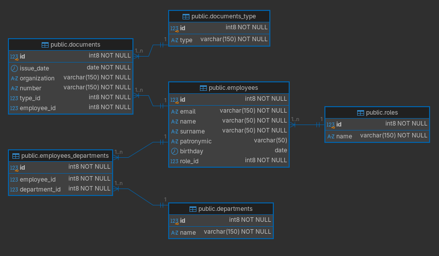

# Задание Axenix — Часть 1 (Проектирование базы данных)

## Описание предметной области

Система учета персонала для внутреннего использования в компании.  
Хранит информацию о сотрудниках, структуре компании (департаментах), должностях и документах сотрудников.

### Бизнес-требования (из ТЗ)

1. **Сотрудник:** ФИО, дата рождения, контактный email, уникальный внутренний идентификатор.
2. **Структура компании:** департаменты (например, «Разработка», «Маркетинг», «Продажи»). Один сотрудник может работать в нескольких департаментах (кросс-функциональные команды).
3. **Позиция:** у каждого сотрудника одна действующая должность.
4. **Документооборот:** у сотрудника может быть несколько документов разных типов (паспорт, ИНН, СНИЛС и др.). Каждый документ имеет номер, дату выдачи и выдающую организацию.

## ER-диаграмма

Диаграмму автоматически сгенерировал в DBeaver .



**Основные сущности и связи:**

- `employees` — сотрудники.
- `departments` — департаменты.
- `roles` — справочник должностей.
- `documents` — документы сотрудников.
- `documents_type` — справочник типов документов.
- `employees_departments` — связь M:N между сотрудниками и департаментами.

**Связи:**

- `employees` → `roles` (M:1) — у сотрудника одна должность.
- `employees` → `documents` (1:M) — у сотрудника много документов.
- `documents` → `documents_type` (M:1) — тип документа.
- `employees` ↔ `departments` (M:N) через `employees_departments`.

## SQL DDL скрипт

```sql
DROP TABLE IF EXISTS employees_departments;
DROP TABLE IF EXISTS documents;
DROP TABLE IF EXISTS employees;
DROP TABLE IF EXISTS departments;
DROP TABLE IF EXISTS roles;
DROP TABLE IF EXISTS documents_type;

CREATE TABLE departments (
    id bigint GENERATED ALWAYS AS IDENTITY NOT NULL PRIMARY KEY,
    name varchar(150) NOT NULL UNIQUE
);

CREATE TABLE roles (
    id bigint GENERATED ALWAYS AS IDENTITY NOT NULL PRIMARY KEY,
    name varchar(150) NOT NULL UNIQUE
);

CREATE TABLE documents_type (
    id bigint GENERATED ALWAYS AS IDENTITY NOT NULL PRIMARY KEY,
    type varchar(150) NOT NULL UNIQUE
);

CREATE TABLE employees (
    id bigint GENERATED ALWAYS AS IDENTITY NOT NULL PRIMARY KEY,
    email varchar(150) NOT NULL UNIQUE,
    name varchar(50) NOT NULL,
    surname varchar(50) NOT NULL,
    patronymic varchar(50),
    birthday date NOT NULL,
    role_id bigint NOT NULL,
    FOREIGN KEY (role_id) REFERENCES roles (id)
);

CREATE TABLE documents (
    id bigint GENERATED ALWAYS AS IDENTITY NOT NULL PRIMARY KEY,
    issue_date date NOT NULL,
    organization varchar(150) NOT NULL,
    number varchar(150) NOT NULL,
    type_id bigint NOT NULL,
    employee_id bigint NOT NULL,
    FOREIGN KEY (type_id) REFERENCES documents_type (id),
    FOREIGN KEY (employee_id) REFERENCES employees (id) ON DELETE CASCADE,
    CONSTRAINT uk_employee_document UNIQUE (employee_id, type_id)
);

CREATE TABLE employees_departments (
    id bigint GENERATED ALWAYS AS IDENTITY NOT NULL PRIMARY KEY,
    employee_id bigint NOT NULL,
    department_id bigint NOT NULL,
    FOREIGN KEY (employee_id) REFERENCES employees (id) ON DELETE CASCADE,
    FOREIGN KEY (department_id) REFERENCES departments (id) ON DELETE CASCADE,
    CONSTRAINT uk_employee_department UNIQUE (employee_id, department_id)
);

```

## Тестовые данные (seed)

Скрипт для наполнения базы данных находится в файле `seed.sql`.
Он создаёт справочники, сотрудников, документы и распределяет сотрудников по департаментам.

## SQL-запросы (Часть 2)

### Запрос 1. Поиск сотрудников по характеристике с сортировкой

**Бизнес-задача:** получить список всех сотрудников, чьи документы (любого типа) были выданы в 2023 году или позже.  
**Логика:** соединяем `employees` с `documents` (по `employee_id`) и `documents_type` (по `type_id`). Фильтруем по дате выдачи `>= '2023-01-01'`. Сортируем по фамилии (возр.) и дате выдачи (убыв.).

```sql
SELECT e.name,
       e.surname,
       e.patronymic,
       dt.type AS document_type,
       d.number,
       d.issue_date
FROM employees e
JOIN documents d ON e.id = d.employee_id
JOIN documents_type dt ON d.type_id = dt.id
WHERE d.issue_date >= '2023-01-01'
ORDER BY e.surname, d.issue_date DESC;
```

### Запрос 2. Анализ распределения сотрудников по департаментам

**Бизнес-задача:** для каждого департамента и каждой должности внутри него вывести количество сотрудников.  
**Логика:** берём таблицу связей `employees_departments`, присоединяем `employees`, `departments` и `roles`. Группируем по названию департамента и должности. Считаем количество сотрудников. Сортируем по департаменту (возр.) и количеству (убыв.).

```sql
SELECT d.name AS department_name,
       r.name AS role_name,
       COUNT(*) AS employee_count
FROM employees_departments ed
JOIN employees e ON e.id = ed.employee_id
JOIN departments d ON d.id = ed.department_id
JOIN roles r ON r.id = e.role_id
GROUP BY d.name, r.name
ORDER BY d.name, COUNT(*) DESC;
```

### Запрос 3. Выявление перегруженных и недогруженных департаментов

**Бизнес-задача:** найти департаменты, где количество сотрудников > 10 или = 1. Для каждого вывести название, общее количество, средний возраст (округлённый) и количество уникальных должностей.  
**Логика:** аналогично агрегируем данные, используем `HAVING` для фильтрации групп. Возраст считаем через `age()` и `EXTRACT(YEAR)`. Сортируем по количеству (убыв.) и названию.

```sql
SELECT d.name AS department_name,
       ROUND(AVG(EXTRACT(YEAR FROM age(e.birthday)))) AS avg_age,
       COUNT(DISTINCT e.role_id) AS unique_roles_count
FROM employees_departments ed
JOIN employees e ON e.id = ed.employee_id
JOIN departments d ON d.id = ed.department_id
GROUP BY d.name
HAVING COUNT(*) > 10 OR COUNT(*) = 1
ORDER BY COUNT(*) DESC, d.name;
```

## Проектные решения

- **Связь M:N** между сотрудниками и департаментами реализована через промежуточную таблицу `employees_departments` с уникальным ограничением на пару `(employee_id, department_id)`.
- **Ограничение `UNIQUE (employee_id, type_id)`** в `documents` гарантирует, что у сотрудника не может быть двух документов одного типа (например, двух паспортов).
- **`ON DELETE CASCADE`** для `employee_id` и `department_id` обеспечивает автоматическую очистку связанных записей при удалении сотрудника или департамента.

## Файлы

- [schema.sql](schema.sql) - DDL-скрипт создания таблиц.
- [seed.sql](seed.sql) - тестовые данные.
- [scripts.sql](scripts.sql) - запросы из 2-ой части задания.
- [image.png](image.png) - ERD-диаграмма.
